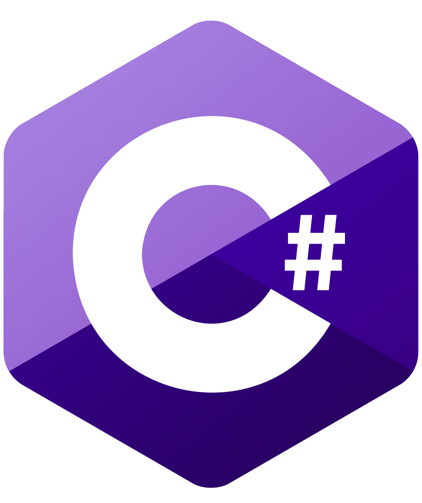
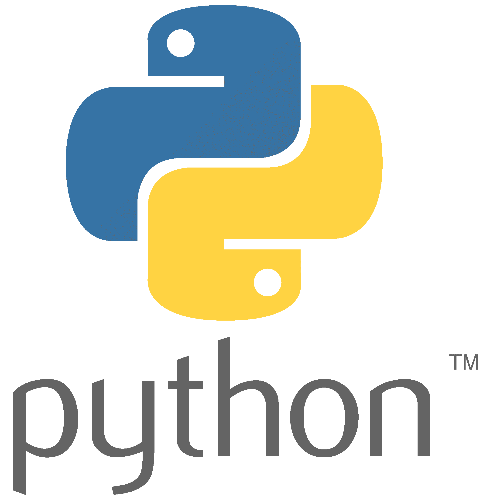
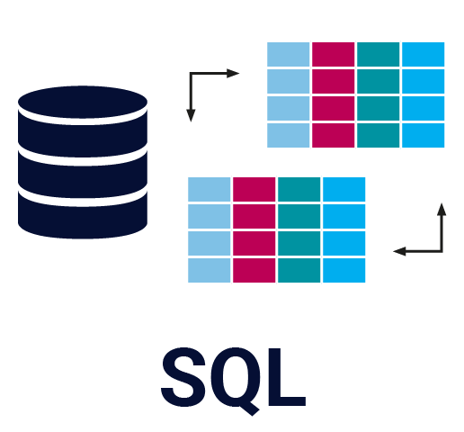
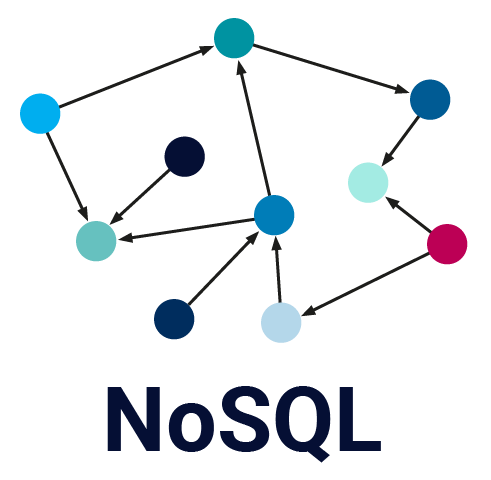
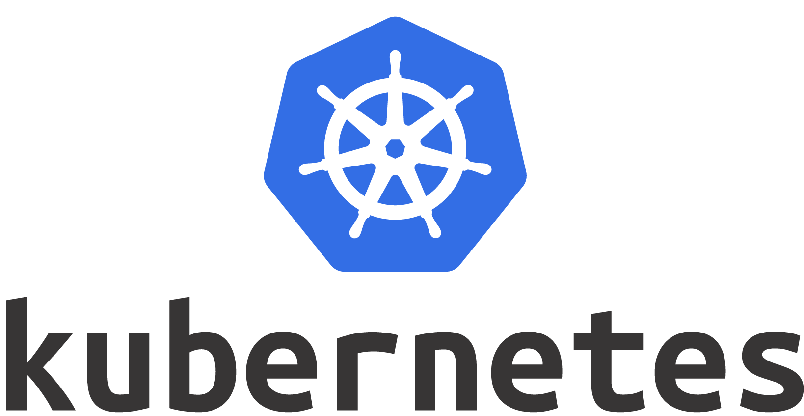

# Hola 👋, Soy André

    

## Skills

------

    
    
    
    
    
    

------

    
    
    
    
    

------

    
    

------

    
    
    

------

    
    
    

------
:black_circle: :black_circle: :black_circle:

------

 

